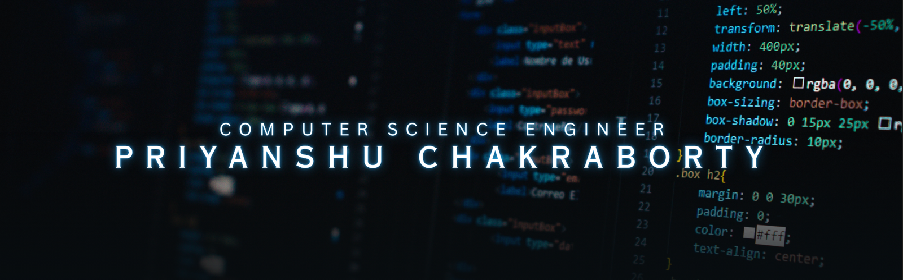

<div align="center">
  
  
  <br>
  <i>"Code is like humor. When you have to explain it, it's bad."</i>
</div>

<div align="center">

### 👨‍💻 About Me

</div>

<table width="100%" border="0"><tr><td width="60%" valign="top"><a href="https://github.com/Priybyte"></a><br><br><p align="left"><a href="https://www.linkedin.com/in/priyanshu-chakraborty-57319028a/" target="_blank"></a>&nbsp;<a href="https://wakatime.com/@WakaPri" target="_blank"></a>&nbsp;<a href="mailto:priyanshu.codendev@gmail.com"></a>&nbsp;<a href="Priyanshu_Chakraborty_Resume.pdf" target="_blank"></a></p><br>• 🎓 <b>B.Tech in Computer Science at VIT Bhopal (Class of 2027)</b><br>• 💻 Exploring scalable backend architectures (Node.js & Express)<br>• 🏆 <b>Milestones:</b> Solved 300+ LeetCode & 100+ Codeforces problems<br>• 🌱 <b>Mastering:</b> Advanced DSA (C++), Web Dev & AWS Deployment<br>• 🤝 Open to collaborate on MERN projects, Gen-AI & hackathons<br>• 🍿 <b>Beyond Coding:</b> You can usually find me watching thriller movies<br>• 🧠 <i>Fun Fact: I spend more time naming variables than writing logic!</i></td><td width="40%" align="center" valign="middle"></td></tr></table>

<p align="center">
  
</p>

<div align="center">

### 🛠️ Tech Stack

<p align="center">
   
   
   
   
   
   
   
   
   
   
   
   
   
   
   
   
   
   
   
   
   
   
  
</p>

</div>

<p align="center">
  
</p>

<div align="center">

### 🐍 Contribution Graph


</div>

<p align="center">
  
</p>

<div align="center">

### 📊 Coding Stats

<table width="100%">
  <tr>
    <td width="50%" align="center" valign="middle">
      <a href="https://leetcode.com/u/LeetPreet/">
        
      </a>
    </td>
    <td width="50%" align="center" valign="middle">
      <a href="https://codeforces.com/profile/Preet10">
        
      </a>
    </td>
  </tr>
</table>

<br>

<details>
  <summary>🔍 <b>CLICK TO SEE A SECRET ABOUT MY CODING JOURNEY...</b></summary>
  <blockquote>
    I once spent 4 hours debugging a C++ Segfault only to realize I forgot to initialize a pointer. <br>
    Lesson learned: Those who don't remember the past are condemned to repeat it! 🐍
  </blockquote>
</details>

</div>

<p align="center">
  
</p>

<div align="center">

## 📈 Github Analytics
<!--  -->
</div>
<div align="center">

<br><br>

<br><br>


</div>

<p align="center">
  
</p>

<br>

<!-- <div align="center">
  
</div> -->

### ⏱️ Weekly Coding Breakdown
<!--START_SECTION:waka-->

```txt
C++   3 hrs 20 mins         █████████████████████████   100.00 %
```

<!--END_SECTION:waka-->

<br>

<div align="center">
<a href="https://github.com/Priybyte">
  
</a>
</div>

<p align="center">
  
</p>

<div align="center">

### ✍️ Random Dev Quote


<br><br><br>

<h2>✨ Let's Connect & Build Something Innovative Together. ✨</h2>

<br>


<br>


</div>


